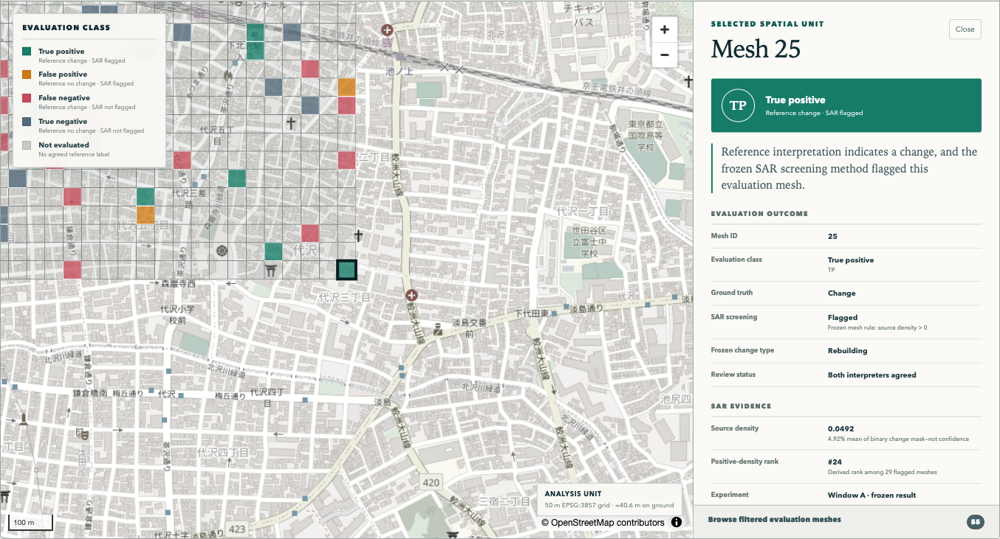

# Urban Change Evidence Explorer
### 🌐 Live Demo
https://0319-2004.github.io/urban-change-evidence-explorer/

## Overview

Urban Change Evidence Explorer is a public-facing Web GIS for inspecting the frozen results of an undergraduate Sentinel-1 SAR urban change-screening study in Shimokitazawa, Tokyo.

The application turns a repository-first review task into a spatial workflow:

**Open the map → select a mesh → inspect the evidence, outcome, limitations, and provenance.**

This is a research viewer. It does not run a new change-detection algorithm, produce building-level predictions, or replace the source study's reported results.

## Research Question

> How much building change can an unsupervised statistical method recover from SAR, and if it fails, what is the structure of that failure?

The source study applies a two-window omnibus likelihood-ratio test to Sentinel-1A VV intensity. The intended use is first-pass screening: prioritizing spatial units for further verification rather than declaring that a specific building changed.

## Why This Viewer Exists

The research repository contains canonical GeoJSON, interpreter CSVs, verification scripts, and detailed scientific records. Those materials are reproducible, but understanding one result requires manually joining a mesh ID across files and then locating it geographically.

This viewer performs only a validated, documented join. It keeps unsupported fields unavailable and makes the source trail visible in the interface.

## Screenshot



## Features

- MapLibre GL JS map centered on the Shimokitazawa study area.
- All 676 source meshes, with TP / FP / FN / TN shown only for the 55 meshes with agreed ground truth.
- Explicit **Not evaluated** state for the other 621 meshes.
- Hover and click interaction plus a keyboard-operable evaluation-mesh browser.
- Evaluation-class and frozen change-type filters.
- Evidence panel with source density, detection rule, observation window, interpreter records, and deterministic explanation.
- Visible research context, scientific limitations, and file-level provenance.
- Static architecture with no backend, credentials, analytics, or LLM API.
- Strict Python preprocessing and Zod validation at the browser boundary.

## Source Research

Source repository: [0319-2004/shimokita-building-change-detection](https://github.com/0319-2004/shimokita-building-change-detection)

Audited source commit: `ef7039a717092e8918b042b23c81b44a8e45f93f`

The frozen Window A experiment compares winter 2019 and winter 2025 Sentinel-1A IW GRD VV observations on descending relative orbit 46. The source 50 m grid is defined in EPSG:3857; its approximate ground dimension is 40.6 m at the study latitude.

See [SOURCE_AUDIT.md](SOURCE_AUDIT.md) for the exact input assessment and scientific boundaries.

## Data

The application dataset is generated from four canonical data files:

- `02_canonical_data/shimokita_density_2025.geojson`
- `02_canonical_data/graduate_thesis_judge_A.csv`
- `02_canonical_data/graduate_thesis_judge_B.csv`
- `02_canonical_data/strict24_members.csv`

Supporting experiment and validation definitions come from:

- `03_verification_scripts/Gee_step5_export.js`
- `03_verification_scripts/verify_matched_alert_count.py`

Frozen application invariants:

| Item | Count |
|---|---:|
| Study meshes | 676 |
| Agreed reference labels | 55 |
| Ground-truth change / no change | 37 / 18 |
| Frozen SAR-positive meshes | 29 |
| TP / FP / FN / TN | 16 / 5 / 21 / 13 |
| Frozen change types (STRICT24) | 24 |

`source_density` is the mean of a binary pixel-level change mask within a mesh. It is not a probability, confidence score, building count, or changed-area measurement.

## Architecture

```text
Read-only research repository
  → scripts/build_app_dataset.py
  → validated EPSG:4326 static data
  → React + TypeScript + Zod
  → MapLibre map + evidence panel
  → static hosting
```

The browser loads three generated files:

- `public/data/meshes.geojson`
- `public/data/experiments.json`
- `public/data/metadata.json`

See [docs/architecture.md](docs/architecture.md) and [TECHNICAL_RESEARCH.md](TECHNICAL_RESEARCH.md).

## Running Locally

Requirements: Node.js 20+ and Python 3.10+.

```bash
npm install
npm run dev
```

Open the local URL printed by Vite.

To rebuild the application dataset from a read-only source clone:

```bash
git clone https://github.com/0319-2004/shimokita-building-change-detection.git ../shimokita-building-change-detection
npm run build:data -- --source-dir ../shimokita-building-change-detection
```

The generator refuses missing columns, duplicate mesh IDs, unsupported types, malformed geometry, unexpected frozen counts, and output paths inside the source repository.

## Data Provenance

`public/data/metadata.json` records:

- source repository and commit;
- every input path and SHA-256 hash;
- application dataset version and generation date;
- source and output coordinate systems;
- derived fields and transformation steps;
- frozen record counts;
- missing-value and license notices.

Detailed documentation: [docs/data-provenance.md](docs/data-provenance.md).

## Scientific Limitations

- Results are mesh-level, not building-level.
- The 50 m label is a Web Mercator grid definition; the ground dimension is about 40.6 m.
- Only 55 meshes have agreed binary ground truth; unevaluated cells must not be interpreted as negatives.
- Ground-truth imagery dates (2017 and 2021) do not fully match the frozen SAR window (2019 and 2025).
- Intensity-based SAR screening can miss rebuilding when similar scattering structures persist.
- Results depend on the selected observation windows.
- The source record documents an incorrect look-number parameter in the frozen implementation. This viewer retains and labels the frozen result; it does not silently substitute a sensitivity analysis.
- The aerial imagery used for human interpretation is not included, so the original interpretation act cannot be independently reproduced from the repository alone.

Detailed documentation: [docs/scientific-limitations.md](docs/scientific-limitations.md).

## Reproducibility

Run the complete local quality gate:

```bash
npm test
npm run build
```

`npm test` runs frontend tests and Python parser tests. Coverage includes source parsing, invalid schemas, evaluation-class mapping, mesh selection state, filtering, missing values, deterministic explanations, client dataset validation, and geometry conversion.

The generated files are committed so the viewer remains deployable without the research repository at runtime. Regenerate them only from a pinned source commit and review metadata/hash changes before publishing.

## Deployment

### GitHub Pages

1. Push this repository to GitHub.
2. In **Settings → Pages**, choose **GitHub Actions** as the source.
3. Push to `main` or run the included **Deploy static viewer to GitHub Pages** workflow manually.

The workflow tests, builds, and deploys `dist/`. Vite uses relative asset paths, so project-site URLs work without hard-coded repository names.

### Vercel

Import the repository and use:

- Build command: `npm run build`
- Output directory: `dist`
- Framework preset: Vite

No environment variables or API secrets are required.

## Related Research

- Conradsen, K., Nielsen, A. A., and Skriver, H. (2016), *Determining the Points of Change in Time Series of Polarimetric SAR Data*, IEEE Transactions on Geoscience and Remote Sensing, 54(5), 3007–3024.
- Nielsen, A. A., Conradsen, K., Skriver, H., and Canty, M. J. (2017), implementation and visualization work in the *Canadian Journal of Remote Sensing*, 43(6), 582–592, DOI `10.1080/07038992.2017.1394182`.
- Petit et al. (2022), *A New Earth Observation Service Based on Sentinel-1 and Sentinel-2 Time Series for the Monitoring of Redevelopment Sites in Wallonia, Belgium*, *Land* 11(3), 360, DOI `10.3390/land11030360`.

These references are contextual. Scientific claims in the viewer are limited to what the audited source repository supports.

## Author

## Author

**Rito Yamasaki**  
School of Global Studies and Collaboration, Aoyama Gakuin University, Japan

Research interests: Remote Sensing, SAR, GIS, GeoAI, and 3D Geoinformation.

This application was developed as research software for the undergraduate project:
[shimokita-building-change-detection](https://github.com/0319-2004/shimokita-building-change-detection).

GitHub: [0319-2004](https://github.com/0319-2004)

## License

Application source code is available under the MIT License; see [LICENSE](LICENSE).

The audited research repository contains no standard `LICENSE` file and asks users to discuss reuse of its data and scripts. The MIT license for this viewer does **not** relicense the source research data or generated derivatives. Confirm public redistribution with the research repository owner before deployment.
