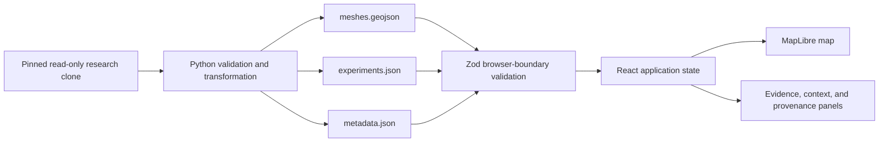

# Architecture

## Design goals

The architecture keeps the research repository read-only, separates scientific preprocessing from presentation, and makes deployment possible as static files.

## Preprocessing boundary

`scripts/build_app_dataset.py` is the only component that understands the canonical source schemas. It:

1. requires all canonical files;
2. validates headers, values, unique IDs, counts, and geometry;
3. reconstructs ground truth only from exact interpreter agreement;
4. retains the frozen `density > 0` mesh decision;
5. joins frozen STRICT24 types without normalizing source strings;
6. transforms EPSG:3857 geometry to EPSG:4326;
7. documents derived fields, source hashes, and counts;
8. writes only to the selected application output directory.

It does not execute Google Earth Engine, recalculate the SAR statistic, write into the source clone, or impute missing evidence.

## Frontend boundary

The frontend treats the generated files as untrusted input and validates them with Zod before rendering. A schema error stops the application with a visible validation message.

React owns:

- selected mesh ID;
- active evaluation classes;
- optional change-type filters;
- evidence-panel and list presentation.

MapLibre owns:

- pan and zoom;
- raster basemap rendering;
- GeoJSON grid layers;
- hover feature state;
- hit testing and map clicks;
- selected-feature outline.

The MapLibre instance is initialized and cleaned up in a React effect because it is an imperative external system. Pure functions handle classification, explanation, and filtering.

## Map layers

Layer order:

1. neutral background;
2. OpenStreetMap raster basemap;
3. low-opacity context fill for all 676 cells;
4. context grid lines;
5. filtered, class-colored evaluation fill;
6. evaluation outlines;
7. hover outline;
8. selected outline;
9. transparent hit area.

The context layers remain visible when filters are active so a result is never detached from the study grid. The matching count reports filter matches, not the number of context cells drawn.

## Basemap behavior

The basemap uses the standard OpenStreetMap raster endpoint with attribution and no token. Research meshes do not depend on basemap availability; the map retains a neutral background and displays a status message if tiles fail.

For high-traffic deployment, configure a production tile provider that permits the expected usage while retaining correct OpenStreetMap attribution.

## Static hosting

The Vite build produces `dist/`. There are no server routes, databases, secrets, or runtime preprocessing steps. Relative asset paths support both GitHub Pages project paths and Vercel.

## Known technical trade-offs

- MapLibre is the dominant JavaScript dependency; the production JavaScript is approximately 333 kB gzip at the documented build.
- The generated GeoJSON is under 1 MB uncompressed and appropriate for a 676-polygon static viewer. Vector tiles would add needless infrastructure.
- The evidence list is limited to evaluated meshes, while all 676 cells remain map-clickable.
- Browser rendering requires WebGL. Research data and documentation remain available in the static files if a browser cannot render the map.
